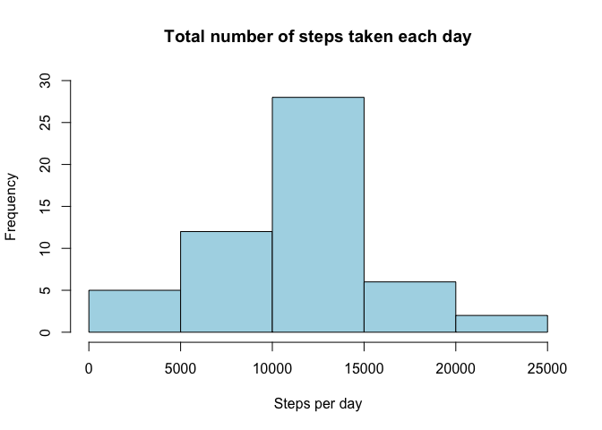
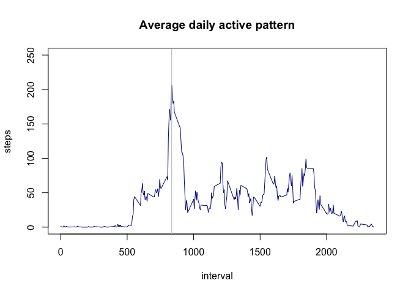
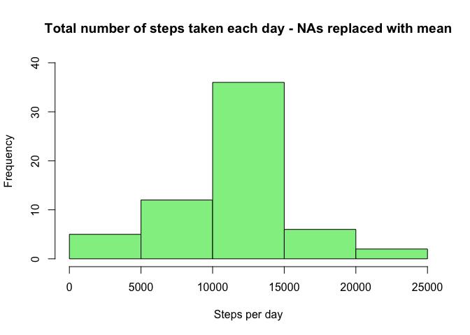
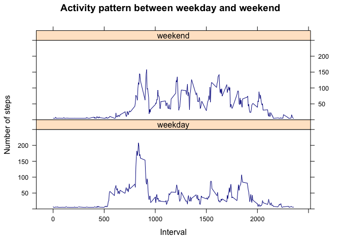

# Reproducible Research: Peer Assessment 1
G.Graner  
8 Apr 2016  

## Loading and preprocessing the data


```r
        if(!file.exists("./activity.csv")) {
                 unzip("./activity.zip", exdir="./")
        }
        
         # if file is in listing, read it
        if("activity.csv" %in% dir()){
                raw_data<-read.csv("activity.csv")
        }else return("activity.csv is missing, please check")
```

## What is mean total number of steps taken per day?

Calculate the total number of steps taken per day

```r
        steps_per_day <- aggregate(steps ~ date,raw_data, sum, na.rm=TRUE)
```

Histogram of the total number of steps taken each day

```r
        hist(steps_per_day$steps, xlab="Steps per day", main="Total number of steps taken each day",
             ylim=c(0,30),col="lightblue")
```



Calculate and report the mean and median of the total number of steps taken per day

```r
        mean(steps_per_day$steps, na.rm = TRUE)
```

```
## [1] 10766.19
```

```r
        median(steps_per_day$steps, na.rm=TRUE)
```

```
## [1] 10765
```

## What is the average daily activity pattern?

```r
        avg_daily_pattern <- aggregate(steps ~ interval, raw_data, mean, na.rm=TRUE)
```

Time series plot (type = "l") of the 5-minute interval (x-axis) and the average number of steps taken, averaged across all days (y-axis)

```r
        plot(avg_daily_pattern, type="l", col="darkblue", 
             main="Average daily active pattern", ylim=c(0,250))
        abline(v=avg_daily_pattern[which.max(avg_daily_pattern$steps), ]$interval, col="grey")
```



Which 5-minute interval, on average across all the days in the dataset, contains the maximum number of steps?

```r
        avg_daily_pattern[which.max(avg_daily_pattern$steps), ]
```

```
##     interval    steps
## 104      835 206.1698
```
Answer: Interval 835.

## Imputing missing values

Total number of missing values in the dataset (i.e. the total number of rows with NAs)

```r
        sum(!complete.cases(raw_data))
```

```
## [1] 2304
```
There are 2304 rows with NAs

Devise a strategy for filling in all of the missing values in the dataset. The strategy does not need to be sophisticated. For example, you could use the mean/median for that day, or the mean for that 5-minute interval, etc.

Mean of average daily active pattern

```r
        mean(avg_daily_pattern$steps, na.rm=TRUE)  
```

```
## [1] 37.3826
```

Find column names with NAs

```r
        colnames(raw_data)[apply(is.na(raw_data), 2, any)]
```

```
## [1] "steps"
```

Create a new dataset that is equal to the original dataset but with the missing data filled in.

```r
        raw_data_na <- raw_data
        # fill in missing values in steps column by using mean()
        raw_data_na$steps[which(is.na(raw_data_na$steps))] <- mean(avg_daily_pattern$steps, na.rm=TRUE)  
```

Make a histogram of the total number of steps taken each day and Calculate and report the mean and median total number of steps taken per day. Do these values differ from the estimates from the first part of the assignment? What is the impact of imputing missing data on the estimates of the total daily number of steps?

Calculate the total number of steps taken per day

```r
        steps_per_day_na <- aggregate(steps ~ date,raw_data_na, sum, na.rm=TRUE)
```

Histogram of the total number of steps taken each day

```r
        hist(steps_per_day_na$steps, xlab="Steps per day", 
             main="Total number of steps taken each day - NAs replaced with mean",
             ylim=c(0,40),col="lightgreen")
```



Calculate and report the mean and median of the total number of steps taken per day

```r
        mean(steps_per_day_na$steps, na.rm = TRUE)
```

```
## [1] 10766.19
```

```r
        median(steps_per_day_na$steps, na.rm = TRUE)
```

```
## [1] 10766.19
```

Mean = Median after imputing NAs, showing that the dataset is no longer skewed.

## Are there differences in activity patterns between weekdays and weekends?

Create a new factor variable in the dataset with two levels – “weekday” and “weekend” indicating whether a given date is a weekday or weekend day.

```r
        # loading library(chron) to use is.weekend()
        library(chron)
        # create factor variable is_weekend
        raw_data_na$is_weekend<-is.weekend(raw_data_na$date)
        raw_data_na$is_weekend[which(raw_data_na$is_weekend==FALSE)]<-"weekday"
        raw_data_na$is_weekend[which(raw_data_na$is_weekend==TRUE)]<-"weekend"
        raw_data_na$is_weekend<-as.factor(raw_data_na$is_weekend)
```

Make a panel plot containing a time series plot (i.e. type = "l") of the 5-minute interval (x-axis) and the average number of steps taken, averaged across all weekday days or weekend days (y-axis).

```r
        # loading library(lattice) to use basic scatterplot
        library(lattice)
        avg_daily_pattern_na <- aggregate(steps ~ interval + is_weekend, raw_data_na, mean, na.rm=TRUE)
        xyplot(steps ~ interval | is_weekend, avg_daily_pattern_na, type="l", col="darkblue", 
               main="Activity pattern between weekday and weekend", ylim=c(0,250), layout=c(1,2), 
               ylab="Number of steps", xlab="Interval")
```



